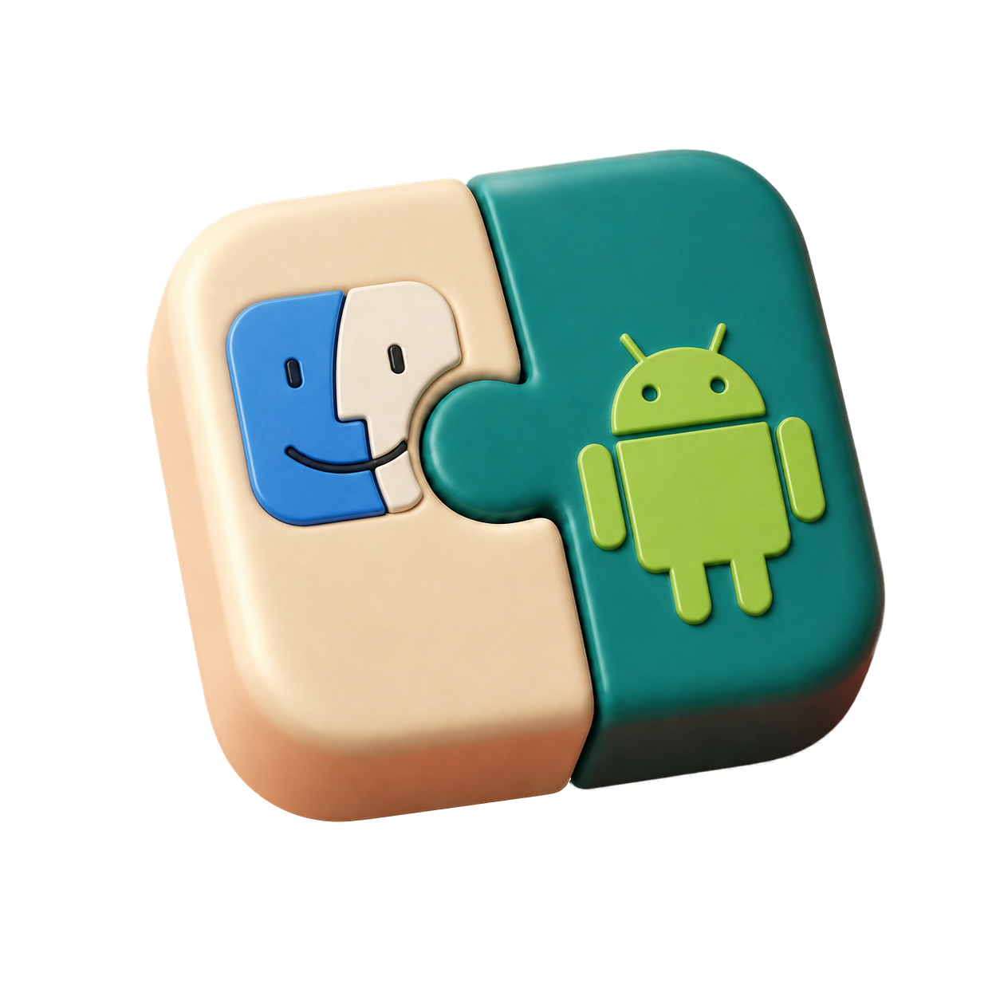

# 연속성 브리지 · Continuity Bridge



**Mac과 Android 사이의 클립보드와 알림을, 직접 운영하는 서버로 연결합니다.**

텍스트를 복사하면 다른 기기로 전달하고, Android 알림은 Mac의 전용 배너와 메뉴 막대 알림 목록에서 확인합니다. Android 앱에 클립보드 도우미가 내장되어 있어 별도 Shizuku 앱을 설치할 필요가 없습니다.

개발자 개인 서버에 가입하는 서비스가 아닙니다. **본인의 도메인, 릴레이 서버, 인증 토큰**으로 설치합니다. 현재는 개발용 배포이며, 아래의 지원 범위와 제한을 확인해 주세요.

## 할 수 있는 일

| 기능 | 동작 |
|---|---|
| 텍스트 공유 | Android ↔ Mac 복사·붙여넣기 |
| 사진 공유 | PNG/JPEG, 사진 한 장 최대 8 MiB. Mac의 TIFF 이미지는 PNG로 변환 |
| Android 알림 | 원래 앱 아이콘, 제목·본문, 최근 100개 알림 목록 |
| 앱별 알림 선택 | Android에서 설치 앱을 검색해 허용·차단. 처음 알림이 오기 전에도 설정 가능 |
| 작업 진행률 | 같은 알림을 조용히 갱신하고 완료·실패 시 다시 알림 |
| 연결 복구 | 일시적인 연결 끊김 재시도, 대기 이벤트 저장·전달 확인 |
| Cloudflare Access | 선택 기능. 기기별 서비스 토큰을 사용한 백그라운드 연결 |

Android의 충전·배터리 같은 상태 알림은 작업 진행률에서 제외합니다. 연결 상시 알림은 Android의 알림 채널 설정에서 숨길 수 있지만, 운영체제가 따로 표시하는 실행 중 앱·무선 디버깅 표시는 앱이 없앨 수 없습니다.

## 필요한 환경

- **Mac:** macOS 13 이상. 제공 ZIP은 Apple Silicon용이며 ad-hoc 서명입니다.
- **Android:** 내장 도우미는 Android 11 이상과 무선 디버깅이 필요합니다. 현재 APK는 arm64-v8a·x86_64를 포함합니다. 제조사별 동작은 다를 수 있습니다.
- **서버:** Ubuntu/Debian LXC 또는 VM, Node.js 24, systemd. 메모리 1 GiB 이상을 기준으로 안내합니다.
- **접속 주소:** 유효한 HTTPS 인증서가 있는 본인 도메인. 안내 예시는 별도 Nginx Proxy Manager(NPM)를 사용합니다.
- **선택:** Cloudflare Access. Proxmox와 Tailscale 자체가 앱의 필수 의존성은 아닙니다.

```text
Mac / Android
      │ HTTPS
      ▼
Cloudflare Access (선택)
      ▼
Nginx Proxy Manager · bridge.example.com
      │ HTTPS · 사설 네트워크
      ▼
본인 Ubuntu/Debian 서버 · Node.js 릴레이
```

릴레이 서버에는 Docker가 필요하지 않습니다. 다른 리버스 프록시도 HTTPS·인증 헤더·본문 크기·long-poll 조건을 맞춰 사용할 수 있습니다.

## 처음 설치하기

### 1. 앱 설치와 기기 ID 준비

[배포 파일 목록](outputs/README.md)에서 다음 파일을 받습니다.

- [Mac 앱 ZIP](outputs/ContinuityBridge.app.zip)
- [Android 내장 도우미 APK](outputs/continuity-bridge-android-embedded-debug.apk)
- [Android 대응 소스·재빌드 자료](outputs/continuity-bridge-android-embedded-source.zip)

각 파일 옆의 `.sha256`로 무결성을 확인합니다. Mac은 ZIP을 풀어 `ContinuityBridge.app`을 응용 프로그램 폴더로 옮기고, Android는 APK를 설치합니다. 스토어 심사·Mac 공증을 마친 배포가 아니므로 운영체제에서 개발용 앱 안내가 나올 수 있습니다.

현재 앱에는 기기 ID 표시 화면이 없어, 최초 서버 등록 때 [기기 ID 확인 안내](continuity-bridge/DEVICE_SETUP.md)의 Mac 터미널·Android ADB 절차가 한 번 필요합니다. ID를 준비한 뒤 다음 단계로 진행합니다. 기존 사용자는 앱을 삭제하지 말고 [업데이트 안내](continuity-bridge/UPGRADE.md)를 따릅니다.

### 2. 본인 릴레이 설치

[Ubuntu/Debian + NPM 설치 안내](continuity-bridge/deploy/lxc/README.md)에 따라 릴레이, 인증서, 역할별 토큰을 준비합니다.

- 릴레이의 `auth.json`에서 Android·Mac 각각의 `deviceId`를 1단계의 ID와 맞춥니다.
- 두 기기는 **서로 다른 역할 토큰**을 사용합니다.
- NPM 본문 한도는 `12m`, 읽기 제한은 `60s`로 설정합니다.
- 릴레이 포트 `8443`에는 NPM 서버만 접근하도록 방화벽을 설정합니다.

문서의 `bridge.example.com`과 사설 IP는 예시입니다. 자신의 값으로 바꿉니다.

### 3. 두 앱에 같은 HTTPS 주소 입력

| 설정 | Mac | Android |
|---|---|---|
| 서버 주소 | `https://bridge.example.com` | 같은 주소 |
| 릴레이 토큰 | macOS 역할 토큰 | Android 역할 토큰 |
| 공인 HTTPS 인증서 | 인증서 핀을 비움 | 시스템 신뢰 저장소 사용 |
| Cloudflare Access | 사용한다면 이 Mac의 Client ID/Secret | 사용한다면 이 폰의 Client ID/Secret |

처음 표시되는 `localhost`나 `10.0.2.2`는 개발 환경용 주소입니다. 반드시 본인 도메인으로 바꿉니다. 일반 설치에는 개발용 인증서 핀을 복사하지 않습니다.

Access를 사용하면 기기별 서비스 토큰을 발급하고 **Service Auth 정책**으로 허용합니다. 브라우저 이메일 로그인만 허용하는 정책은 앱의 백그라운드 연결에 맞지 않습니다. 릴레이 토큰도 함께 필요합니다. [Cloudflare 공식 안내](https://developers.cloudflare.com/cloudflare-one/access-controls/service-credentials/service-tokens/)

### 4. Android 도우미 연결

1. 브리지의 **클립보드 도우미 설정**에서 개발자 옵션을 엽니다.
2. Android의 **무선 디버깅**을 켭니다.
3. 설정과 브리지를 **분할 화면**으로 열고, 설정에서 **페어링 코드로 기기 페어링**을 누릅니다.
4. 코드 창을 열어 둔 채 브리지에 6자리 코드를 입력하고 **코드로 연결**을 누릅니다.
5. 알림도 공유하려면 브리지의 **알림 접근**을 허용하고 **알림을 보낼 앱 선택**을 설정합니다.

도우미는 이 폰 내부의 ADB에 연결해 클립보드를 읽습니다. 복사할 때 별도 창을 띄우지 않습니다. 최초 페어링, 포트 구분, 재부팅 자동 복구 조건은 [내장 도우미 안내](continuity-bridge/android/EMBEDDED_HELPER.md)에 있습니다.

### 5. 공유 시작

두 앱에서 설정을 저장하고 **시작**합니다. 연결 상태와 Android의 **복사 공유 준비됨**을 확인한 뒤 짧은 텍스트로 양방향 전송을 시험합니다. 알림은 Android에서 허용한 앱의 새 알림으로 확인합니다.

## 알아둘 제한

- **사진 공유는 실험적입니다.** Galaxy → Mac PNG/JPEG는 원본 일치를 확인했지만, Mac → Galaxy 사진의 재전송 방지 검사에는 미해결 항목이 있습니다.
- 일반 파일 전송, 클립보드 기록 검색, 알림 답장은 지원하지 않습니다. 이미지 대신 URL을 복사하는 앱에서는 사진이 전송되지 않을 수 있습니다.
- Android나 원래 앱이 잠금 화면에서 내용을 숨기면 숨겨진 내용을 복원하지 않습니다.
- Android 13 이상의 재부팅 자동 복구는 선택 기능입니다. 첫 잠금 해제, 허용된 Wi-Fi, 유지된 페어링 기록이 필요하며 제조사별 재검증이 필요합니다.
- Mac 전용 배너는 macOS 집중 모드와 별도로 동작합니다. 앱의 **배너 잠시 끄기**로 제어합니다.
- 통신은 HTTPS로 보호하지만 **종단간 암호화는 아닙니다.** 릴레이와 TLS를 종료하는 프록시 운영자는 전달 내용을 볼 수 있습니다. 릴레이 상태 파일에도 전달 대기 내용이 저장됩니다.
- 여러 사용자가 공유하는 서비스나 여러 기기 전체 동기화를 보장하지 않습니다. Mac 한 대와 Android 한 대의 개인 릴레이 구성을 기준으로 사용합니다.

검증된 환경과 미확인 항목은 [검증 기록](HANDOFF.md)에 구분했습니다.

## 소스에서 빌드·개발

[빌드 안내](continuity-bridge/BUILD.md)에서 SDK/JDK 설정, Mac 패키징, 로컬 인증서와 테스트 실행 방법을 설명합니다.

| 디렉터리 | 내용 |
|---|---|
| `continuity-bridge/android` | Android 앱과 내장 ADB 도우미 |
| `continuity-bridge/macos` | Swift 메뉴 막대 앱 |
| `continuity-bridge/relay` | Node.js HTTPS 릴레이 |
| `continuity-bridge/deploy/lxc` | Linux 서비스와 NPM 설정 예제 |
| `continuity-bridge/protocol` | 프로토콜 명세와 계약 테스트 |
| `continuity-bridge/integration` | 통합 검증기 |
| `outputs` | 설치 파일·체크섬·대응 소스 |

인증 토큰, 인증서 개인키, 앱 데이터, ADB 페어링 키는 저장소에 넣지 않습니다. 포함된 공개 인증서는 로컬 개발용입니다. 의존성 출처와 재배포 자료는 [의존성 안내](continuity-bridge/android/dependencies/embedded-README.md)에 정리되어 있습니다. 프로젝트 전체에 적용하는 별도 라이선스는 아직 지정하지 않았습니다.
